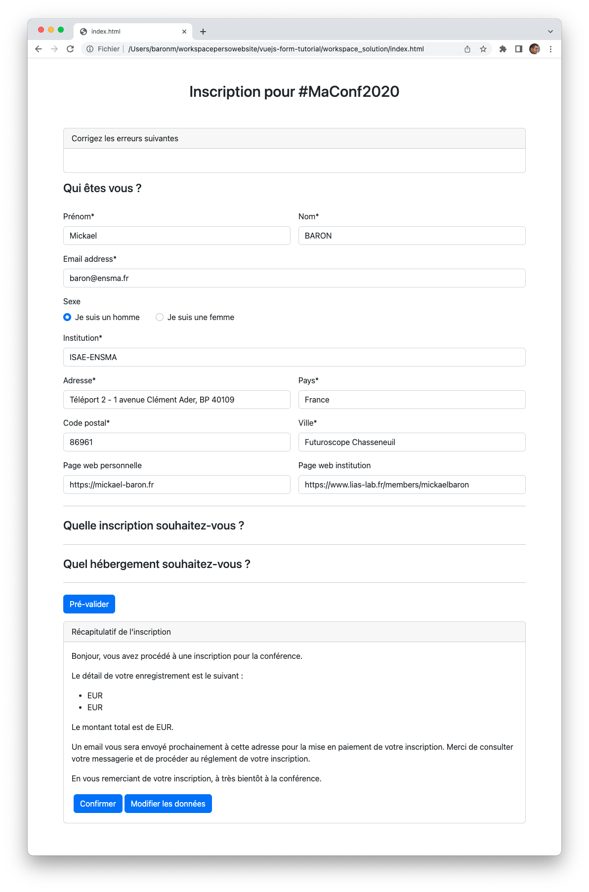
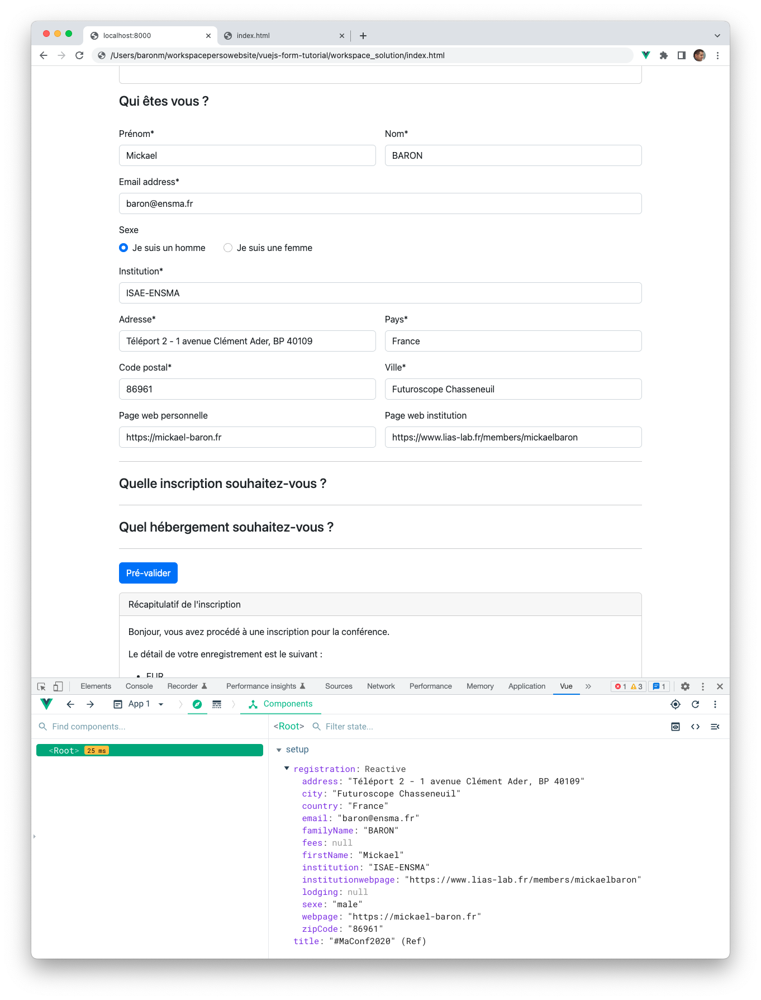

# Exercice 2 : réaliser des liaisons bidirectionnelles entre le modèle et la vue

Ce deuxième exercice s'intéresse à créer des liaisons bidirectionnelles entre un objet `Vue` via ses propriétés et la partie graphique via les composants HTML. Dans le cas du formulaire d'inscription scientifique, nous allons relier chaque zone de saisie (email, nom, prénom...) à une propriété de l'objet `Vue`.

## But

* Utiliser les directives `v-model` et `v-once`.
* Déboguer son application avec l'outil **Vue-DevTools**.

## Étapes à suivre

* Éditer le contenu du fichier _index.js_ en ajoutant une propriété réactive `registration` initialisée comme `reactive`. Cette proprité `registration` définit un objet de treize propriétés correspondant respectivement aux zones de saisies suivantes : email, prénom, nom, sexe, institution, adresse, code postal, ville, pays, page web, page web de l'institution, type d'inscription et mode d'hébergement. Vous respecterez la convention de nommage **camelCase** (les mots sont liés sans espace et chaque mot commence par une majuscule à l’exception du premier) et l'usage de l'anglais. Afin de faciliter le développement, vous initialiserez les propriétés avec des valeurs par défaut.

```JavaScript
const { createApp, ref, reactive } = Vue

createApp({
    setup() {
        const title = ref('#MaConf2020')
        const registration = reactive(
            {
                email: 'baron@ensma.fr',
                firstName: 'Mickael',
                familyName: 'BARON',
                sexe: 'female',
                institution: 'ISAE-ENSMA',
                address: 'Téléport 2 - 1 avenue Clément Ader, BP 40109',
                zipCode: '86961',
                city: 'Futuroscope Chasseneuil',
                country: 'France',
                webpage: 'https://mickael-baron.fr',
                institutionWebpage: 'https://www.lias-lab.fr/members/mickaelbaron',
                fees: null,
                lodging: null
            }
        )
        return { title, registration }
    }
}).mount('#app');
```

* Éditer le contenu du fichier _index.html_ en utilisant la directive `v-model` pour créer des liaisons bidirectionnelles pour chaque propriété définie précédemment. Pour l'instant, ne vous occupez pas de réaliser la liaison bidirectionnelle pour les propriétés liées au type d'inscription et du mode d'hébergement. À titre d'exemple, nous donnons le code correspondant à la laison entre la propriété `email` et une zone de saisie de type email.

```html
...
<!-- Email -->
<div class="col-12">
    <label for="inputEmail" class="form-label">Email address*</label>
    <input type="email" class="form-control" id="inputEmail" aria-describedby="emailHelp"
        v-model="registration.email">
</div>
...
```

* Afficher la page web sur votre navigateur et vous devrez constater que les zones de saisie sont automatiquement pré-remplies comme montré sur la figure ci-dessous.



* Nous allons utiliser l'outil **Vue-DevTools** pour consulter et éditer les états de l'objet `Vue`. Depuis votre navigateur, ouvrir les outils de développeur (l'option est générallement disponible à partir du menu contextuel) et sélectionner l'onglet Vue (voir image ci-dessous).



* Modifier des valeurs des zones de saisie depuis le formulaire d'inscription, vous constaterez que depuis l'outil **Vue-DevTools** les propriétés associées sont modifiées. Modifier les valeurs de propriétés depuis l'outil **Vue-DevTools**, vons constaterez alors que les valeurs des zones de saisie sont également impactées. Les liaisons bidirectionnelles fonctionnent parfaitement. 

Vous pouvez également modifier la valeur de la propriété `title` utilisée dans le premier exercice pour illustrer l'interpolation de texte. Toutefois, on peut vouloir bloquer sa modification après le premier rendu car il n'y a pas de nécessité à ce que sa valeur change.

* Modifier le fichier _index.html_ en ajoutant la directive `v-once` comme attribut à la balise `<h1>`.

```html
...
<body>
    <script src="https://unpkg.com/vue@3"></script>
    <div id="app" class="container">
        <main>
            <div class="py-5">
                <h2 v-once>Inscription pour {{ title }}</h2>
            </div>
    ...
</body>
```

* Depuis l'outil **Vue-DevTools**, modifier la valeur de la propriété `title`, vous constaterez que le rendu n'est pas modifié sur la page HTML.